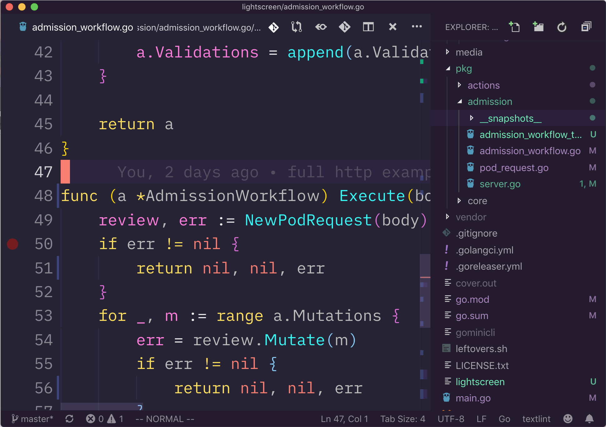

# Make VSCode More Like Vim

You can use [https://github.com/VSCodeVim/Vim](VSCodeVim), and call it a day. I personally prefer to use it as a starting point and configure  it to look and feel like one of the more popular Vim distros, such as Janus or spf13.

Here's how it looks:

## Highlights

In addition to what you get out of the box with VSVim, you get:

* VSCode Vim as extension.
* Explorer (files) behaves like NERDTree: `ma` - add files, `mm` rename, `mf` add folder, `md` delete.
* Move between panes, directional: `ctrl+w [hjkl]`.
* Jump to file explorer: `cmd+0`.
* Escape: `jj`.
* Navigate popup lists from your `hjkl`: `ctrl+j` or `ctrl+k` when popup (code completion, etc.) appears.
* Quick cycle through errors / warnings: `cmd+shift+j` or `cmd+shift+k`.
* `;` is `:` in normal mode.
* leader `space`
    * Save: `space`+`w`.
    * Close: `space`+`c`.
* Right sidebar: better eye-alignment with gutter / code.
* NO minimap, sidebars, tabs, folding or any other UI artifacts that's not needed for editing code.

## Contributing

A few things are missing from this set up to be more like what I'm used to. For example fuzzy seach in File Explorer (there's something close but not quite).

It all depends on the level of support and capabilities in VSCode and VSCodeVim, both of which are always improving.

If you can hack something to be closer to how Vim should be, feel free to let me know in the [issues](https://github.com/jondot/make-vscode-more-like-vim/issues).

